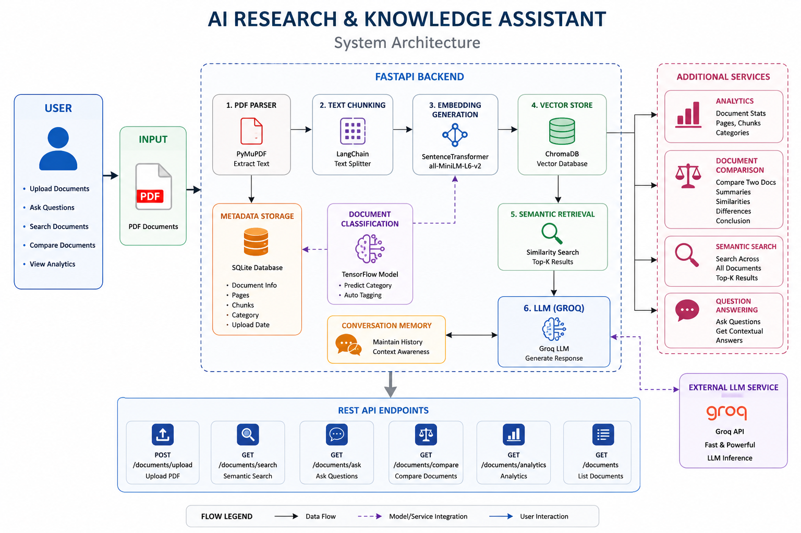

# AI Research & Knowledge Assistant

An AI-powered **Retrieval-Augmented Generation (RAG)** system that enables users to upload PDF documents, perform semantic search, ask context-aware questions, classify documents using TensorFlow, compare multiple documents, and retrieve intelligent answers using a Large Language Model (LLM).

---

## 📑 Table of Contents

- [Project Overview](#-project-overview)
- [Objectives](#-objectives)
- [System Architecture](#-system-architecture)
- [Key Features](#-key-features)
- [Technology Stack](#-technology-stack)
- [Project Structure](#-project-structure)
- [Installation](#-installation)
- [Environment Variables](#-environment-variables)
- [API Endpoints](#-api-endpoints)
- [Design Decisions](#-design-decisions)
- [Assumptions](#-assumptions)
- [Limitations](#-limitations)
- [Future Improvements](#-future-improvements)
- [Author](#-author)

---

# 📖 Project Overview

The **AI Research & Knowledge Assistant** is an intelligent document analysis system built using **FastAPI**, **ChromaDB**, **SentenceTransformers**, **TensorFlow**, and **Groq LLM**.

Instead of manually searching through lengthy documents, users can upload PDF files and interact with them using natural language. The application extracts text from uploaded PDFs, divides it into meaningful chunks, converts each chunk into vector embeddings, stores them inside a vector database, and retrieves the most relevant information to generate accurate answers.

The project combines document processing, semantic search, vector databases, machine learning, and large language models to provide an intelligent research assistant capable of understanding and comparing documents.

---

# 🎯 Objectives

- Build an end-to-end Retrieval-Augmented Generation (RAG) pipeline.
- Enable semantic search across uploaded PDF documents.
- Generate context-aware answers using Groq LLM.
- Automatically classify uploaded documents using TensorFlow.
- Compare multiple documents intelligently.
- Maintain conversation history.
- Store document metadata for analytics.
- Provide REST APIs using FastAPI.

---

# 🏗️ System Architecture

> Replace the image below with your architecture diagram.

```markdown

```

---

# 🚀 Key Features

### 📄 Document Management

- Upload PDF documents
- Automatic PDF text extraction
- Metadata storage using SQLite
- Multi-document support

### 🔍 Semantic Search

- Vector embedding generation
- Similarity search using ChromaDB
- Retrieve relevant document chunks

### 🤖 AI Question Answering

- Retrieval-Augmented Generation (RAG)
- Context-aware answers
- Groq LLM integration

### 🧠 Document Classification

- TensorFlow-based classifier
- Automatic category prediction
- Classification during document upload

### 📊 Analytics

- Total uploaded documents
- Total processed pages
- Total chunks generated
- Category distribution

### 🔄 Multi-Document Comparison

- Compare two uploaded documents
- Similarity detection
- Difference extraction
- AI-generated summary
- AI-generated conclusion

### 💬 Conversation Memory

- Stores previous conversations
- Supports follow-up questions
- Maintains context

### 🌐 REST API

- FastAPI backend
- OpenAPI documentation
- Swagger UI
- JSON responses

---

# 🛠️ Technology Stack

| Category | Technology |
|-----------|------------|
| Programming Language | Python 3.11+ |
| Backend Framework | FastAPI |
| API Server | Uvicorn |
| Database | SQLite |
| ORM | SQLAlchemy |
| PDF Processing | PyMuPDF (fitz) |
| Text Chunking | LangChain Text Splitter |
| Embedding Model | SentenceTransformers (all-MiniLM-L6-v2) |
| Vector Database | ChromaDB |
| Large Language Model | Groq API |
| Machine Learning | TensorFlow |
| Semantic Search | Vector Similarity Search |
| Data Validation | Pydantic |
| API Documentation | Swagger UI (OpenAPI) |
| Version Control | Git & GitHub |

---

# 📂 Project Structure

```text
AI-Research-Knowledge-Assistant/
│
├── app/
│   ├── api/
│   ├── database/
│   ├── models/
│   ├── schemas/
│   ├── services/
│   ├── utils/
│   └── main.py
│
├── uploads/
├── chroma_db/
├── assets/
│   └── Architecture.png
│
├── tensorflow_model/
├── sample_documents/
├── requirements.txt
├── .env.example
├── README.md
└── LICENSE
```

---

# ⚙️ Installation

## Clone Repository

```bash
git clone https://github.com/yourusername/AI-Research-Knowledge-Assistant.git

cd AI-Research-Knowledge-Assistant
```

## Create Virtual Environment

```bash
python -m venv venv
```

Windows

```bash
venv\Scripts\activate
```

Linux / macOS

```bash
source venv/bin/activate
```

## Install Dependencies

```bash
pip install -r requirements.txt
```

## Run Server

```bash
uvicorn app.main:app --reload
```

---

# 🔐 Environment Variables

Create a `.env` file.

```env
GROQ_API_KEY=your_groq_api_key

DATABASE_URL=sqlite:///database.db
```

---

# 📡 API Endpoints

| Method | Endpoint | Description |
|---------|----------|-------------|
| POST | /documents/upload | Upload PDF |
| GET | /documents | List uploaded documents |
| GET | /documents/search | Semantic search |
| GET | /documents/ask | Ask questions |
| GET | /documents/compare | Compare two documents |
| GET | /documents/analytics | View analytics |

Swagger UI

```
http://localhost:8000/docs
```

---

# 🎯 Design Decisions

- FastAPI chosen for high-performance REST APIs.
- ChromaDB used for efficient vector similarity search.
- SentenceTransformers used to generate semantic embeddings.
- SQLite selected as a lightweight metadata database.
- TensorFlow used for document classification.
- Groq LLM integrated for fast response generation.
- Modular architecture implemented for scalability and maintainability.

---

# 📌 Assumptions

- Input documents are PDF files.
- Documents contain extractable text.
- Internet connection is available for Groq API.
- TensorFlow model is pre-trained.
- ChromaDB stores document embeddings locally.

---

# ⚠️ Limitations

- Supports only PDF documents.
- OCR is not available for scanned PDFs.
- TensorFlow classifier accuracy depends on training data.
- Conversation memory resets after application restart.
- Requires internet access for LLM responses.

---

# 🚀 Future Improvements

- User authentication and authorization.
- OCR support for scanned documents.
- Multi-language document support.
- Streaming LLM responses.
- Cloud database integration.
- Docker deployment.
- Kubernetes support.
- User dashboard.
- Feedback and rating system.
- Hybrid search (keyword + vector search).

---

# 👨‍💻 Author

**Pavan Kalyan Musham**

AI Research & Knowledge Assistant Project
